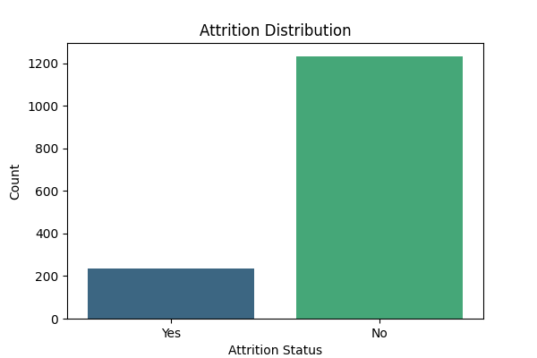
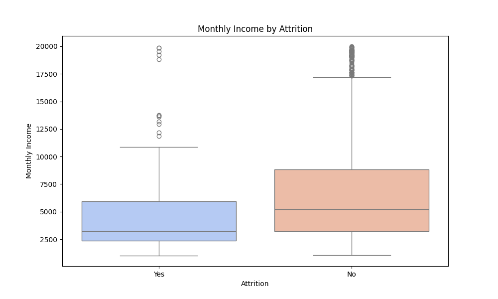
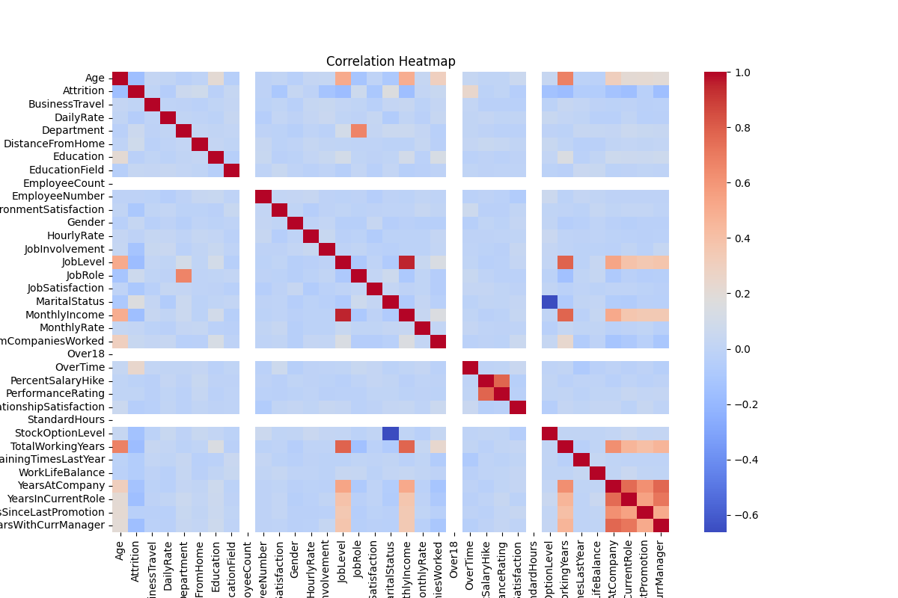
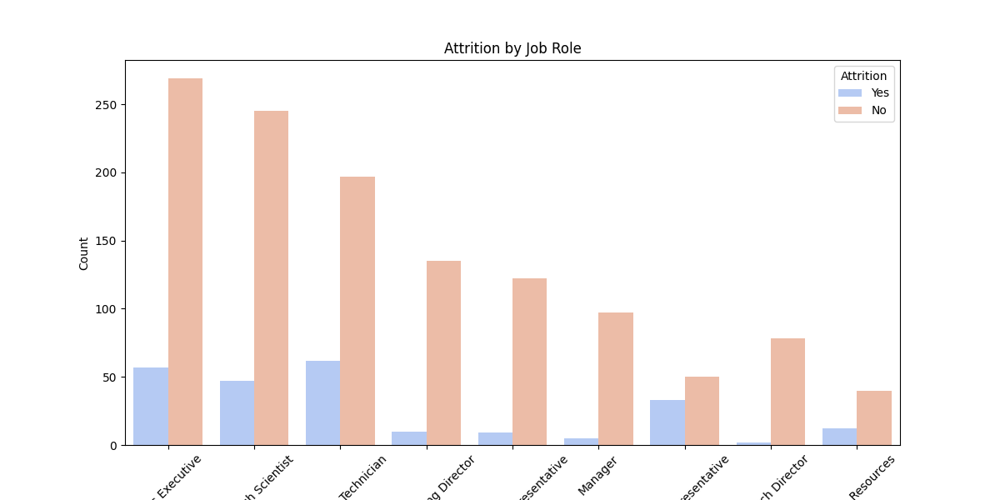
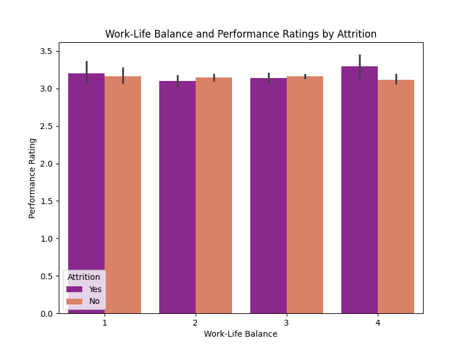
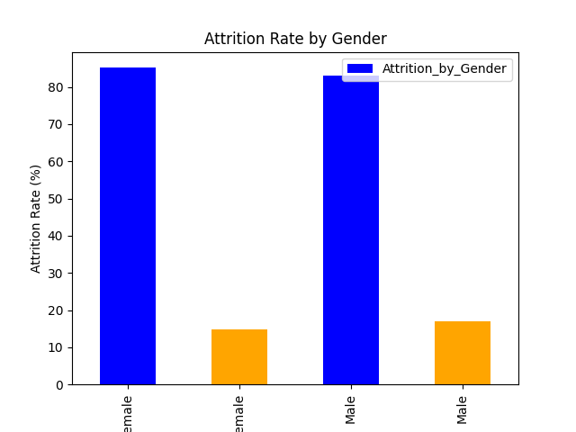
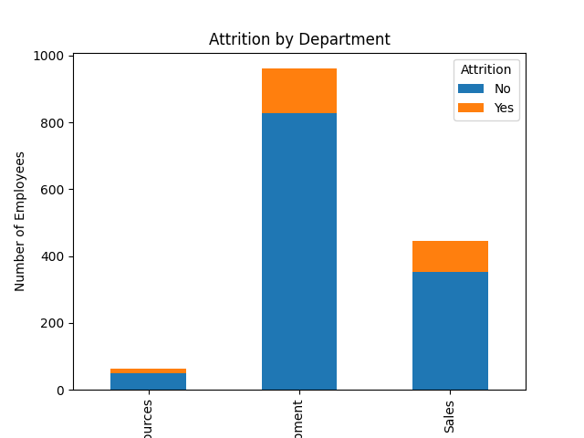
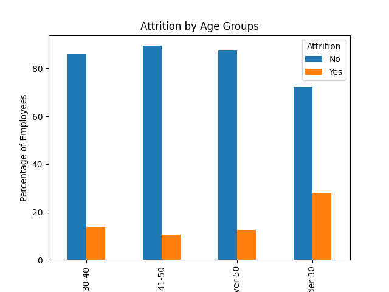
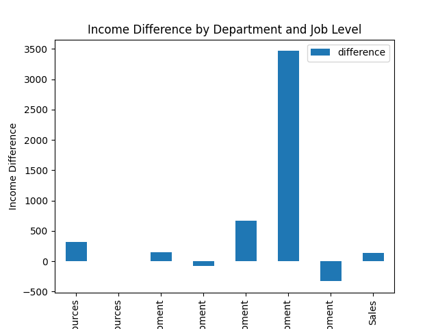
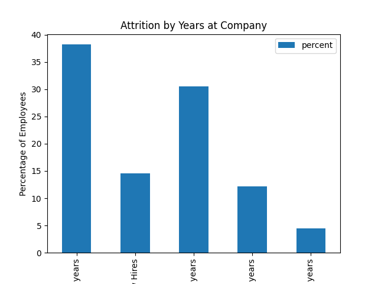

Predictive HR Analytics Dashboard for Attrition Management
Overview
This project analyzes employee data to identify key factors that influence attrition and employee performance. Using data preprocessing, exploratory data analysis (EDA), and predictive modeling, the project aims to help organizations reduce employee attrition and improve workforce performance.


Table of Contents
Project Objective
Dataset
Technologies Used
Key Steps
Visualizations
How to Run the Code
Results and Insights
Contributions
License
Project Objective
The primary goal of this project is to:

Identify factors contributing to employee attrition.
Propose strategies to improve employee retention and performance.
Build a pipeline for data analysis and create visualizations for actionable insights.
Dataset
The dataset used for this project is a fictional HR dataset containing:

Features: Employee demographics, job roles, performance metrics, salaries, work-life balance, etc.
Target Variable: Attrition (Yes/No), indicating whether an employee has left the organization.
Technologies Used
Python Libraries:
pandas, numpy – Data preprocessing and cleaning.
matplotlib, seaborn – Data visualization.
Tools:
Jupyter Notebook
GitHub for project hosting.
Key Steps
1. Data Preprocessing
Handled Missing Values: Filled numerical features with median and categorical ones with mode.
Removed Duplicates: Ensured data quality by dropping duplicate entries.
Encoded Categorical Variables: Converted categorical columns into numerical format using one-hot encoding.
2. Exploratory Data Analysis (EDA)
Analyzed the distribution of Attrition and key factors like:
Monthly Income vs Attrition
Job Role vs Attrition
Work-Life Balance vs Attrition
Visualized relationships and patterns in data using heatmaps, bar plots, and boxplots.
3. Feature Engineering
Created new features, such as Tenure (from YearsAtCompany), to understand the impact of employee tenure on attrition.
4. Correlation Analysis
Identified top features correlated with attrition to prioritize actionable insights.
Visualizations
Below are some of the key visualizations created during the analysis:

Attrition Distribution
This chart shows the percentage of employees who left versus those who stayed.



Monthly Income by Attrition
A boxplot to understand if salary differences impact attrition.



Correlation Heatmap
This heatmap highlights the relationship between various features and the attrition variable.



Attrition by Job Role
This bar plot shows attrition rates across different job roles.



Work-Life Balance and Performance Ratings by Attrition
Analyzing how work-life balance and performance ratings differ for employees who leave versus those who stay.
#### Work-Life Balance and Performance Ratings


Load the dataset and execute the steps in the notebook.
Results and Insights
Key Attrition Drivers:
Low monthly income.
Poor work-life balance.
High distance from home.
Certain job roles have higher attrition rates.
Recommendations:
Improve employee compensation for roles with high attrition.
Enhance work-life balance policies.
Focus retention strategies on employees with shorter tenures.
Contributions
Feel free to contribute by:

Improving the analysis.
Adding new features or models.
Reporting any issues.

# Predictive HR Analytics Dashboard - Part 2 (SQL Analysis)

## Overview
In this continuation of the project, we explore the HR Analytics dataset using SQL. Our focus is on calculating attrition rates, analyzing key factors, and deriving insights to address high attrition.

---

## Key Visualizations
### 1. Attrition Rate by Gender
This bar plot shows the attrition rate among male and female employees.



---

### 2. Attrition by Department
This stacked bar chart highlights attrition rates across different departments.



---

### 3. Attrition by Age Groups
This chart demonstrates attrition rates across various age groups.



---

### 4. Income Difference by Department and Job Level
This chart shows income differences for employees who left vs. stayed in each department and job level.



---

### 5. Attrition by Years at Company
This bar chart shows attrition percentages for employees based on their tenure.



---

## Key Findings
- **Gender**: Male employees had slightly higher attrition rates compared to females.
- **Departments**: Sales and Human Resources showed higher attrition compared to Research & Development.
- **Age Groups**: Employees under 30 and over 50 experienced higher attrition rates.
- **Income**: Employees with lower income across departments tend to leave more often.
- **Years at Company**: New hires and employees with 2-5 years of tenure are more likely to leave.

---

## How to Run
1. Clone the repository:
   ```bash
   git clone https://github.com/your-username/HR-Analytics-Dashboard.git
   cd HR-Analytics-Dashboard

License
This project is licensed under the MIT License. See the LICENSE file for details.
